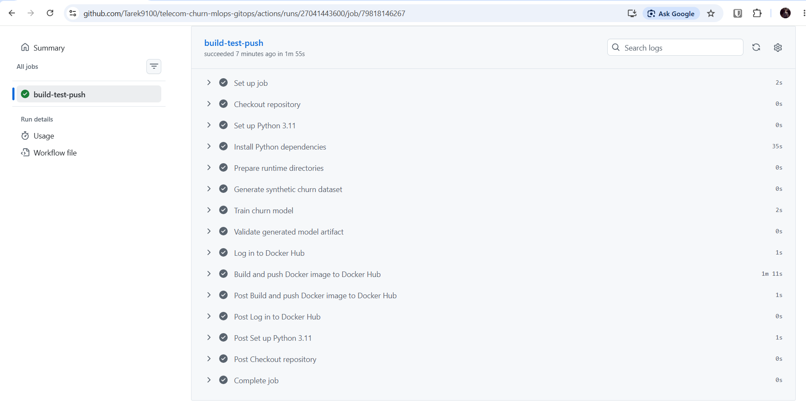
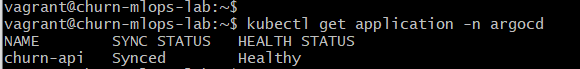
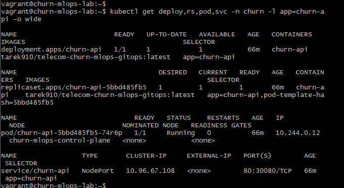
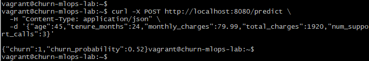
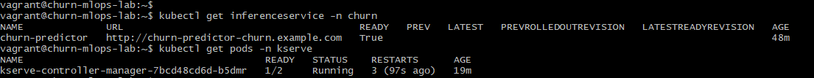
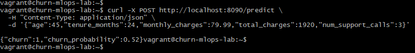

# Telecom Churn MLOps GitOps Platform

A practical end-to-end MLOps project for serving a telecom customer churn prediction model using modern DevOps, GitOps, and Kubernetes-native ML serving practices.

This project starts from a simple churn prediction model and extends it into a complete local MLOps platform with:

- model training
- FastAPI inference
- Docker image build
- GitHub Actions CI/CD
- Docker Hub image publishing
- Kubernetes deployment on kind
- Argo CD GitOps deployment
- KServe custom predictor deployment

---

## Project Overview

The goal of this project is to demonstrate how a machine learning model can move from a local Python script into a deployable, automated, Kubernetes-based inference platform.

The model predicts whether a telecom customer is likely to churn based on customer attributes such as:

- age
- customer tenure
- monthly charges
- total charges
- number of support calls

Example request:

```json
{
  "age": 45,
  "tenure_months": 24,
  "monthly_charges": 79.99,
  "total_charges": 1920.00,
  "num_support_calls": 3
}
```

Example response:

```json
{
  "churn": 1,
  "churn_probability": 0.52
}
```

---

## Architecture

```text
Developer
  ↓ git push
GitHub Repository
  ↓ triggers
GitHub Actions CI/CD
  ↓ builds and pushes image
Docker Hub
  ↓ image pulled by Kubernetes
kind Kubernetes Cluster
  ↑ synced by Argo CD
FastAPI Churn Inference API
```

KServe extension:

```text
KServe InferenceService
  ↓
KServe Predictor Deployment
  ↓
FastAPI Churn Model Container
  ↓
Prediction Response
```

> The base Kubernetes application is managed by Argo CD from `k8s/base`.
>
> The KServe `InferenceService` manifest is stored in Git under `k8s/kserve` and is applied manually in this local lab after KServe is installed. This keeps the GitOps baseline stable while still demonstrating Kubernetes-native model serving with KServe.

---

## Tech Stack

| Category | Tools |
|---|---|
| Model development | Python, pandas, scikit-learn |
| API serving | FastAPI, Uvicorn |
| Containerization | Docker |
| Registry | Docker Hub |
| CI/CD | GitHub Actions |
| Kubernetes | kind, kubectl, Kustomize |
| GitOps | Argo CD |
| ML serving | KServe |
| Local lab | Vagrant, VirtualBox, Ubuntu |

---

## Repository Structure

```text
.
├── api.py
├── generate_data.py
├── train.py
├── requirements.txt
├── Dockerfile
├── .dockerignore
├── .gitignore
├── README.md
├── k8s/
│   ├── base/
│   │   ├── namespace.yaml
│   │   ├── deployment.yaml
│   │   ├── service.yaml
│   │   └── kustomization.yaml
│   └── kserve/
│       ├── inferenceservice.yaml
│       └── kustomization.yaml
├── argocd/
│   └── application.yaml
├── docs/
│   └── images/
│       ├── 01-github-actions-success.png
│       ├── 02-argocd-healthy.png
│       ├── 03-k8s-base-resources.png
│       ├── 04-base-api-prediction.png
│       ├── 05-kserve-ready.png
│       └── 06-kserve-prediction.png
└── .github/
    └── workflows/
        └── mlops-ci.yaml
```

---

## End-to-End Workflow

```text
1. Developer pushes code to GitHub
2. GitHub Actions starts the CI/CD workflow
3. Synthetic churn dataset is generated
4. The churn model is trained
5. The model artifact is validated
6. Docker image is built
7. Image is pushed to Docker Hub
8. Argo CD syncs Kubernetes manifests from Git
9. Kubernetes pulls the image and runs the FastAPI app
10. KServe can serve the same image as a custom predictor
11. Client sends prediction request and receives churn result
```

---

## CI/CD Pipeline

GitHub Actions performs:

1. checkout source code
2. install Python dependencies
3. create runtime directories
4. generate synthetic churn dataset
5. train churn model
6. validate generated model artifact
7. build Docker image
8. push Docker image to Docker Hub

Docker image:

```text
tarek910/telecom-churn-mlops-gitops:latest
```

---

## Local Development

Create a virtual environment:

```bash
python -m venv .venv
source .venv/Scripts/activate
```

Install dependencies:

```bash
python -m pip install --upgrade pip setuptools wheel
python -m pip install -r requirements.txt
```

Create runtime directories:

```bash
mkdir -p data models
```

Generate data:

```bash
python generate_data.py
```

Train the model:

```bash
python train.py
```

Run the API:

```bash
python -m uvicorn api:app --host 0.0.0.0 --port 8000 --reload
```

Test prediction:

```bash
curl -X POST http://localhost:8000/predict \
  -H "Content-Type: application/json" \
  -d '{"age":45,"tenure_months":24,"monthly_charges":79.99,"total_charges":1920,"num_support_calls":3}'
```

---

## Docker

Build locally:

```bash
docker build -t telecom-churn-mlops-gitops:local .
```

Run locally:

```bash
docker run --rm -p 8000:8000 telecom-churn-mlops-gitops:local
```

Test:

```bash
curl -X POST http://localhost:8000/predict \
  -H "Content-Type: application/json" \
  -d '{"age":45,"tenure_months":24,"monthly_charges":79.99,"total_charges":1920,"num_support_calls":3}'
```

---

## Kubernetes Deployment

The base Kubernetes manifests are located in:

```text
k8s/base
```

Apply manually:

```bash
kubectl apply -k k8s/base
```

Check resources:

```bash
kubectl get deploy,rs,pod,svc -n churn -o wide
```

Test through NodePort:

```bash
curl -X POST http://localhost:8080/predict \
  -H "Content-Type: application/json" \
  -d '{"age":45,"tenure_months":24,"monthly_charges":79.99,"total_charges":1920,"num_support_calls":3}'
```

---

## GitOps with Argo CD

The Argo CD application manifest is located in:

```text
argocd/application.yaml
```

Apply the Argo CD application:

```bash
kubectl apply -f argocd/application.yaml
```

Check status:

```bash
kubectl get application churn-api -n argocd
```

Expected:

```text
NAME        SYNC STATUS   HEALTH STATUS
churn-api   Synced        Healthy
```

Argo CD watches:

```text
k8s/base
```

and continuously reconciles the Kubernetes cluster with the desired state stored in Git.

---

## KServe Custom Predictor

This project includes a KServe `InferenceService` that deploys the same FastAPI churn model container as a custom predictor.

KServe manifest:

```text
k8s/kserve/inferenceservice.yaml
```

Apply manually after KServe is installed:

```bash
kubectl apply -k k8s/kserve
```

Check status:

```bash
kubectl get inferenceservice -n churn
kubectl get deploy,svc,pod -n churn
```

Expected:

```text
churn-predictor   True
```

KServe creates a predictor service:

```text
churn-predictor-predictor
```

Port-forward the KServe-created service:

```bash
kubectl port-forward -n churn svc/churn-predictor-predictor 8090:80
```

Test prediction through KServe:

```bash
curl -X POST http://localhost:8090/predict \
  -H "Content-Type: application/json" \
  -d '{"age":45,"tenure_months":24,"monthly_charges":79.99,"total_charges":1920,"num_support_calls":3}'
```

Example response:

```json
{
  "churn": 1,
  "churn_probability": 0.52
}
```

---

## Proof of Execution

### 1. GitHub Actions Pipeline



### 2. Argo CD GitOps Sync



### 3. Kubernetes Base Deployment



### 4. Base API Prediction



### 5. KServe InferenceService



### 6. KServe Prediction



---

## Validation Commands

Check node:

```bash
kubectl get nodes -o wide
```

Check Argo CD:

```bash
kubectl get application churn-api -n argocd
```

Check Kubernetes resources:

```bash
kubectl get deploy,rs,pod,svc -n churn -o wide
```

Check deployed image:

```bash
kubectl get deployment churn-api -n churn \
  -o jsonpath='{.spec.template.spec.containers[0].image}{"\\n"}'
```

Check KServe:

```bash
kubectl get pods -n kserve
kubectl get inferenceservice -n churn
```

Test base Kubernetes service:

```bash
curl -X POST http://localhost:8080/predict \
  -H "Content-Type: application/json" \
  -d '{"age":45,"tenure_months":24,"monthly_charges":79.99,"total_charges":1920,"num_support_calls":3}'
```

Test KServe service:

```bash
curl -X POST http://localhost:8090/predict \
  -H "Content-Type: application/json" \
  -d '{"age":45,"tenure_months":24,"monthly_charges":79.99,"total_charges":1920,"num_support_calls":3}'
```

---

## Current Status

Implemented:

- synthetic churn data generation
- churn model training
- FastAPI inference API
- Dockerized model serving
- Docker Hub image publishing
- GitHub Actions CI/CD
- Kubernetes deployment on kind
- Argo CD GitOps deployment for the base application
- KServe custom predictor manifest
- working real-time inference through Kubernetes service
- working real-time inference through KServe predictor service

Planned improvements:

- DVC for model and dataset versioning
- Prometheus and Grafana monitoring
- request/response logging
- model performance tracking
- canary or blue-green rollout strategy
- production-grade security hardening

---
